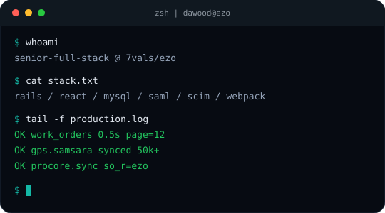
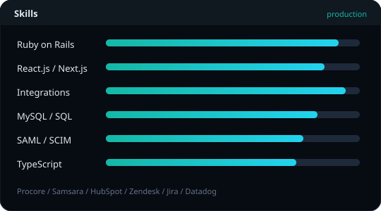
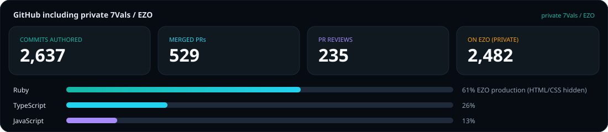
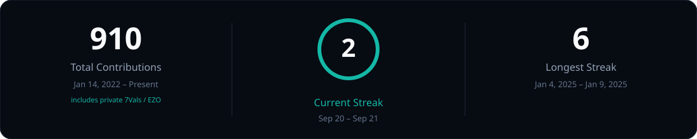
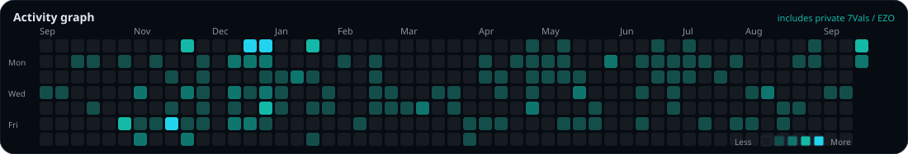

<div align="center">

<!-- ANIMATED HEADER WITH WAVING EFFECT -->


<!-- ANIMATED TYPING SVG -->
<a href="https://git.io/typing-svg">
  
</a>

<!-- SOCIAL BADGES -->
<p>
  <a href="https://www.dawoodjaveed.com" target="_blank">
    
  </a>
  <a href="mailto:dawoodjaved443@gmail.com">
    
  </a>
  <a href="https://www.linkedin.com/in/dawood-javeed-a750891a1" target="_blank">
    
  </a>
  <a href="https://github.com/dawoodjaved" target="_blank">
    
  </a>
  <a href="tel:+923066562443">
    
  </a>
</p>

<!-- PROFILE STATS -->
<p>
  
  
  
</p>

</div>

---

##  About Me

Full Stack Software Engineer with **5+ years** of experience designing, building, and optimizing high-performance web applications for enterprise SaaS. Deep expertise in **Ruby on Rails**, **React.js**, and **TypeScript**, with a track record of shipping cloud integrations, database optimization, identity and access management, and production-grade security. Known for turning complex customer workflows into scalable, maintainable systems with measurable business impact.

```typescript
const dawood: Developer = {
  name: "Dawood Javeed",
  location: "Lahore, Pakistan 🇵🇰",
  role: "Senior Software Engineer",
  company: "7vals (EZO)",
  experience: "5+ years",
  education: {
    degree: "BSc Computer Science",
    institution: "UET Lahore",
    cgpa: 3.4
  },

  highlights: {
    frontendModernization: "83% pagination latency reduction (3.0s → 0.5s)",
    telematicsAtScale: "Real-time GPS telemetry for 50,000+ assets",
    databaseOptimization: "98% faster mass-checkout for 10,000+ assets",
    enterpriseIntegrations: "Procore, Samsara, John Deere, Hapn, Zendesk, Jira",
    identityAndSecurity: "SAML 2.0 SSO, SCIM, OAuth 2.0, XSS and SQL injection hardening",
    teamLeadership: "Mentored 5+ engineers with 95% on-time sprint delivery"
  },

  currentlyFocusedOn: [
    "Enterprise SaaS integrations and event-driven pipelines",
    "Performance engineering at large-account scale",
    "Identity, SSO, and security-first development",
    "Technical mentorship and engineering excellence"
  ],

  askMeAbout: [
    "Full-stack development", "System architecture", "REST APIs and webhooks",
    "Database optimization", "SSO / SCIM", "DevOps and CI/CD", "Agile leadership"
  ]
};
```

<div align="center">

### 🎯 Career Highlights

<table>
  <tr>
    <td align="center" width="25%">
      <br/>
      <strong>Performance</strong><br/>
      <sub>83% faster Work Orders<br/>98% faster mass-checkout</sub>
    </td>
    <td align="center" width="25%">
      <br/>
      <strong>Integrations</strong><br/>
      <sub>70% faster provider onboarding<br/>50K+ assets on live telemetry</sub>
    </td>
    <td align="center" width="25%">
      <br/>
      <strong>Leadership</strong><br/>
      <sub>5+ engineers mentored<br/>95% on-time sprint delivery</sub>
    </td>
    <td align="center" width="25%">
      <br/>
      <strong>Security</strong><br/>
      <sub>SAML 2.0, SCIM, OAuth 2.0<br/>XSS and SQLi remediation</sub>
    </td>
  </tr>
</table>

</div>

---

##  Tech Stack

<div align="center">

### 💻 Languages and Frameworks

<table>
<tr>
<td align="center" width="96">

<br>Ruby
</td>
<td align="center" width="96">

<br>Rails
</td>
<td align="center" width="96">

<br>JavaScript
</td>
<td align="center" width="96">

<br>TypeScript
</td>
<td align="center" width="96">

<br>React
</td>
<td align="center" width="96">

<br>Next.js
</td>
<td align="center" width="96">

<br>Redux
</td>
</tr>
<tr>
<td align="center" width="96">

<br>Node.js
</td>
<td align="center" width="96">

<br>Express
</td>
<td align="center" width="96">

<br>HTML5
</td>
<td align="center" width="96">

<br>CSS3
</td>
<td align="center" width="96">

<br>Webpack
</td>
<td align="center" width="96">

<br>jQuery
</td>
<td align="center" width="96">

<br>React Native
</td>
</tr>
</table>

### 🗄️ Databases and Search

<table>
<tr>
<td align="center" width="96">

<br>PostgreSQL
</td>
<td align="center" width="96">

<br>MySQL
</td>
<td align="center" width="96">

<br>MongoDB
</td>
<td align="center" width="96">

<br>Elasticsearch
</td>
</tr>
</table>

### ☁️ Cloud, DevOps, and Monitoring

<table>
<tr>
<td align="center" width="96">

<br>AWS
</td>
<td align="center" width="96">

<br>Azure
</td>
<td align="center" width="96">

<br>Docker
</td>
<td align="center" width="96">

<br>GitHub Actions
</td>
<td align="center" width="96">

<br>Git
</td>
<td align="center" width="96">

<br>Postman
</td>
<td align="center" width="96">

<br>VS Code
</td>
</tr>
</table>

**Security and Auth:** SAML 2.0 SSO · SCIM · OAuth 2.0 · LDAP · XSS Prevention · SQL Injection Prevention

**Testing and Observability:** RSpec · Automated Testing · Unit Testing · Datadog · APM · Kibana · Airbrake · Errbit

**Integrations:** Procore · Samsara · John Deere · Hapn · SkyBitz · Zendesk Apps · Jira Apps · HubSpot · Apollo · Slack API

**AI and LLM Tools:** Cursor · GitHub Copilot · Claude · Groq

</div>

---

##  GitHub Performance Metrics

<div align="center">

<table>
<tr>
<td width="50%" valign="top">
  
</td>
<td width="50%" valign="top">
  
</td>
</tr>
</table>



<p>
  
  
  
  
  
  
  
</p>








</div>

---

##  Professional Journey

<div align="center">

### 🏢 Senior Software Engineer @ 7vals (EZO)
**📅 June 2022 – Present** | **📍 Lahore, Pakistan**

Enterprise asset intelligence platform spanning EZOfficeInventory, AssetSonar, EZRentOut, and EZO CMMS.

</div>

<details open>
<summary><b>🎯 Key Achievements and Impact</b></summary>
<br/>

#### 🚀 Frontend Modernization and Performance Engineering
- **Led end-to-end migration** of the Work Orders module from Ruby on Rails ERB views to React.js, eliminating full-page reloads and reducing pagination latency by **83%** (3.0s to 0.5s) while building a reusable component library.
- **Optimized SQL queries** with strategic indexing and removed N+1 and over-fetching patterns, cutting mass-checkout processing time for **10,000+ assets by 98%**.
- Diagnosed large-account bulk-import bottlenecks, MDM sync query batching, and repeated dropdown and settings-page query issues using Datadog traces.
- Migrated Webpack 3 to Webpack 5 and upgraded NPM packages, improving build reliability and reducing build errors by **40%**.
- Drove React UX depth with multi-select filters across Catalog, Items, Work Orders, Software, and Weekly Planner.

#### 🏗️ Architecture, Integrations, and IoT
- **Architected a unified GPS and telematics platform** for Samsara, Hapn, John Deere, and SkyBitz using extensible patterns and event-driven pipelines, cutting new-provider integration time by **70%** and enabling live location, engine state, and device health for **50,000+ assets**.
- **Shipped a bidirectional Procore construction integration** with EZO as the system of record, syncing equipment creates, updates, deletes, state actions, and maintenance into Procore Equipment Register via REST APIs.
- Built HubSpot CRM integrations with Redmine and Apollo, mapping Active versus Historic engineering work onto Company and Deal records and auto-enriching blank contacts, replacing manual CSV analysis for Sales and Customer Success.
- Delivered Zendesk and Jira agent apps across EZO, AssetSonar, and CMMS so service desks can run work orders, licenses, contracts, retirement, bundles, history, and localization without leaving their ticketing tool.
- Expanded internationalization for Zendesk and Jira apps across EZO, AssetSonar, and CMMS, extending product reach to **8+ language markets**.

#### 📦 Inventory, Workflows, and Fulfillment
- Delivered **end-to-end batch management** for inventory and asset stock: checkout and transfer by batch, bulk import, APIs, barcodes, soft-delete of zero-quantity lines, and Blind Audit modes.
- Owned enterprise cart and reservation approval workflows, including partial line-item approval, multi-tier cart reservation approvals, and value-based automation routing.
- Built Request Portal and Request Management Center capabilities for General Requests, analytics dimensions, fulfillment bulk actions, and wait-time metrics.
- Extended the Automation Engine to Assets and Work Orders, adding custody-verification and purchase-order automations plus editable CMMS checklists.

#### 🔐 Identity, Security, and Reliability
- Integrated enterprise authentication using **SAML 2.0 SSO** with Google Workspace and Azure Active Directory, plus LDAP password routing for sensitive actions.
- Established **SCIM** synchronization and monitoring through APM tools, including Okta and Azure migrations, enabling faster detection and troubleshooting of production issues.
- Strengthened application security by remediating XSS and SQL injection findings through strict input validation and secure coding practices.
- Developed comprehensive **RSpec** automated test suites for backend services, business-critical workflows, and API integrations, reducing regressions and supporting confident production releases.

#### 👨‍🏫 Leadership and Product Growth
- Mentored **5+ junior developers**, conducted weekly code reviews, and maintained a **95% on-time sprint delivery** rate across Agile and Scrum cycles.
- Designed role-based dashboards and permission-driven UIs for trial users, admins, and staff, enforcing secure access control with a tailored user experience.
- Shipped PLG Trial Dashboard, item and CMMS KPI widgets, multi-dashboard access, and Discovery Guide improvements for self-serve onboarding.

</details>

---

<div align="center">

### 🏢 Associate Software Engineer @ Frizhub Solutions
**📅 July 2021 – February 2022** | **📍 Lahore, Pakistan**

</div>

<details open>
<summary><b>🎯 Key Contributions</b></summary>
<br/>

- Engineered production-ready **MERN stack** applications using MongoDB, Express.js, React.js, and Node.js, supporting a **3x increase in user traffic** without performance degradation.
- Integrated RESTful APIs into React applications, streamlining frontend-backend communication and accelerating feature delivery.
- Designed modular application architecture and reusable components, improving code maintainability and reducing duplicate logic.
- Established team coding standards and documentation practices, reducing new-developer onboarding time and improving code-review approval rates by **20%**.

</details>

---

<div align="center">

### 🏢 Full Stack Web Developer @ Skyline Code Labs
**📅 June 2019 – June 2021** | **📍 Lahore, Pakistan**

</div>

<details open>
<summary><b>🎯 Key Contributions</b></summary>
<br/>

- Built full-stack web applications using **Ruby on Rails** and **React.js**, delivering production MVPs on schedule while maintaining long-term scalability.
- Improved database performance across **MySQL** and **PostgreSQL** by restructuring queries and adding strategic indexing, cutting average query response times by up to **60%**.
- Managed cloud deployments on Netlify, achieving consistent uptime and smooth scaling.
- Collaborated with clients to define project scope and requirements, delivering **10+ projects** on time and within budget with a **95% client satisfaction** rate.

</details>

---

##  Signature Projects

<div align="center">

### 🔧 Work Orders Module Migration


Led the complete migration of the Work Orders module from Rails ERB views to React.js. Architected a scalable, reusable component library for the frontend layer.

**Impact:** 83% pagination latency reduction (3.0s to 0.5s) · Zero full-page reloads · Faster operator workflows

---

### 📡 Unified GPS and Telematics Platform


Architected an extensible telematics integration framework for Samsara, Hapn, John Deere, and SkyBitz. Live location, engine state, and device health land in maps, dashboards, and asset detail.

**Impact:** 70% faster provider onboarding · Real-time tracking for 50,000+ assets · Reusable IoT integration pattern

---

### 🏗️ Procore Construction Integration


Built a production bidirectional integration with EZO as the system of record for company-level equipment. Syncs creates, updates, deletes, state actions, and maintenance into Procore Equipment Register.

**Impact:** Single source of truth for construction fleets · Event-driven plus timed reconciliation · Enterprise-ready equipment register sync

---

### 🎫 Zendesk and Jira Agent Apps


Extended Zendesk and Jira agent apps across EZO, AssetSonar, and CMMS so service desks can run work orders, software licenses, contracts, retirement, bundles, and history without leaving the ticketing tool.

**Impact:** Service desk as the front door to asset operations · Software Licenses API · 8+ language markets

---

### 📦 Batch Inventory and Blind Audits


Delivered end-to-end batch management for inventory and asset stock, covering checkout and transfer by batch, bulk import, APIs, barcodes, and Blind Audit modes that keep physical counts unbiased.

**Impact:** Inventory accuracy across UI, import, API, and labels · Custody verification automation · Audit integrity

---

### 👨‍💻 CodePair — Real-Time Collaborative Coding


Engineered a real-time code collaboration platform with Monaco Editor, WebSocket synchronization, live cursor tracking, instant execution across 10+ languages via Judge0 API, live chat with typing indicators, and interview mode with timer and question bank.

**Impact:** Live cursors · 10+ languages · Interview-ready collaboration

---

### 🚀 SaaSify 2025 — Enterprise SaaS Boilerplate


Created a production-ready SaaS boilerplate with multi-tenant architecture, NextAuth.js authentication (Email and Google OAuth), Stripe billing with a 14-day free trial, role-based access control, team invitations, and Docker deployment.

**Impact:** Multi-tenant · Auth · Billing · Docker-ready launch path

---

### 🐛 Bug Assignment and Tracking System


Developed a cross-product bug tracking and assignment system with real-time Slack alerts, Google Sheets dashboards, automated status updates, Redmine integration, and escalation workflows.

**Impact:** 50% faster engineering response time · Real-time alerts · Automated escalation

---

### 💊 Medication Reminder App


Launched a cross-platform mobile application for daily medication management with smart push notifications, OCR-based medicine label scanning, medication history tracking, and secure OTP phone authentication, deployed via Expo and EAS CLI.

**Impact:** Cross-platform · OCR scanning · Secure OTP auth

</div>

---

## 🎓 Education

<div align="center">

**Bachelor of Science in Computer Science**  
University of Engineering and Technology (UET), Lahore, Pakistan  
2015 – 2019 · CGPA 3.4 / 4.0

</div>

---

##  Let's Build Something Extraordinary

<div align="center">

### 🤝 Open for Collaboration

I am passionate about **transformative enterprise products** that combine strong architecture, measurable performance, and security-first delivery.

### 💼 Available For:
🚀 **Full-Time Opportunities** | 💼 **Contract Projects** | 🤝 **Technical Consulting** | 🎓 **Mentorship**

<br/>

### 📬 Let's Connect

<p>
  <a href="mailto:dawoodjaved443@gmail.com">
    
  </a>
  <a href="https://www.linkedin.com/in/dawood-javeed-a750891a1" target="_blank">
    
  </a>
  <a href="https://dawoodjaveed.com" target="_blank">
    
  </a>
  <a href="https://github.com/dawoodjaved" target="_blank">
    
  </a>
</p>

### 📱 Connect With Me

<p>
  <a href="https://www.facebook.com/share/1BdFc4b5Kf/" target="_blank">
    
  </a>
  <a href="https://www.instagram.com/dawood_javeed/?utm_source=qr&igsh=dXRxZnNxaGd0NHFv#" target="_blank">
    
  </a>
</p>

</div>

---

<div align="center">

### 💭 Developer Wisdom


### 😄 Random Dev Humor


---

### 📊 Profile Summary


---


**✨ "First, solve the problem. Then, write the code." – John Johnson**

**💙 Made with passion by Dawood Javeed | Building the future, one commit at a time**

</div>
